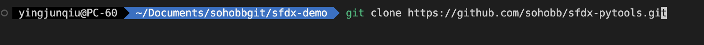

# sfdx-pytools

sfdx のプロジェクトファイルを表や画像などに変換し、資料作成や既存環境調査を簡単にする。

## インストール

1. vscode の sfdx プロジェクトに入る

2. `git clone https://github.com/sohobb/sfdx-pytools.git`をターミナルで実行する
   
   

3. [最新版の python3](https://www.python.org/downloads/) を インストールする

4. ターミナル命令を実行する

   ```shell
   cd sfdx-pytools && pip install -r sfdx-pytools/requirement.txt
   ```

5. sfdx-pytools フォルダーでターミナル命令を実行して結果ファイルが生成される

## 使い方

1. **命令**を実行する
2. `sfdx-pytools/result`フォルダーに**結果ファイル**を探す

## 命令

1. `python workflow_to_csv.py object_api`
   オブジェクト単位で Workflow Rule を csv テーブルに変換する

   - **前提**: 関連ファイルが存在している
     (例えば`force-app/main/default/workflows/Case.workflow-meta.xml`)
   - **結果ファイル**: `sfdx-pytools/result/object_api.workflow-meta.csv`
   - **例**:`python workflow_to_csv.py Case`
     |From|To|
     |---|---|
     |  |  |

2. `python processbuilder_to_csv.py process_api`
   プロセス単位で Process Builder を csv テーブルに変換する
   - **前提**: 関連ファイルが存在している(例えば`force-app/main/default/flows/case_finish.flow-meta.xml`)
   - **結果ファイル**: `sfdx-pytools/result/process_api.flow-meta.csv`
   - **例**:`python processbuilder_to_csv.py case_finish`
     |From|To|
     |---|---|
     |  |  |
3. `python object_relationship.py [object_api]`
   オブジェクト間の参照関係を可視化する。オブジェクトを指定する場合、オブジェクトに関わる参照関係のみを表示する

   - **前提**: 関連ファイルが存在している
   - **注意**: ローカルにダウンロードされたファイルのみが含まれる
   - **結果ファイル**: `object_api.html`または`all-objects.html`(ブラウザーで開ける)
   - **例**:
     | From | To 指定しない<br>`python object_relationship.py` | To A\_\_c 指定する<br> `python object_relationship.py A__c` | To B\_\_c 指定する<br>`python object_relationship.py B__c` |
     | ----------------- | ------------------------------------------------ | ----------------------------------------------------------- | ---------------------------------------------------------- |
     |  |  |  |  |
